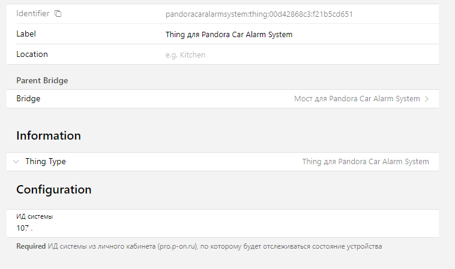

# Pandora Car Alarm System Binding

------------

Русское описание | [English description](README_EN.md)

Binding использует **_неофициальный API_**, полученный в результате reverse engineering, к официальному сайту Pandora https://p-on.ru. 

Для настройки Вам следует использовать те же авторизационные данные, что вы используете на сайте Pandora.

#### **Текущая версия имеет только отображать информацию. Отправлять команды еще не умее**

## Supported Things

------------

Можно создавать несколько Bridge и несколькко Things.

- `bridge`: отправляет запросы к Pandora и получает информацию об устройстве, событиях/опциях/состояниях. Не имеет каналов для настройки.

- `thing`: используя Bridge получает и отображает информацию для заданного устройства (ИД Системы)

## Discovery

------------

Discovery не поддерживается

## Binding Configuration

------------

Создайте биндинг и укажите логиин и пароль для доступа к Личному кабинету https://pro.p-on.ru

Бридж отправляет запросы к api с определенной периодичностью. По0умолчанию это значение составляет 180 сек, т.е. раз в 3 минуты. 

Вы можете поменять это значения в Advansed. 

Минимальное значение 15 сек.

## Thing Configuration

------------

После настройки бриджа вы можете создать и настроить Things.

Сначала в настройках Thing выберите ранее созданный Bridge.

Затем укажите ИД системы из Личного кабинета

Скопируйте ИД системы и вставьте

Если у вас в ЛК привязано несколько систем, то Вы их можете подключить как разные Thing.

## Каналы

------------

Каналы разделены на группы для более удобного восприятия
- _**device**_ - предоставляет информацию о названии, модели, версии прошивки и т.д.
- _**telemetry**_ - предоставляет телеметрию с устройства, такую как напряжение бортовой сети, температуру двигателя, скорость, остаток топлива в баке и т.д. Не все каналы могут быть доступны (отображать актуальную информацию). Это зависит от того, может ли устройство получить такую инфорацию по CAN или другими способами.
- _**states**_ - предоставляет информацию о режиме охраны, состоянии дверей, багажника и т.д.

### PS В следующих версиях перечень каналов может быть изменен/переименован. А также может быть изменена группировка.

## Благодарность

------------

Перед тем как начать разрабатывать биндинг, я поизучал как Личный кабинет шлет запросы и получает ответы. Все есть в js-скриптах, которые можно посмотреть через интсрументы разработчика в браузере.

На создание биндинга натолкнула вот эта страничка [https://github.com/turbulator/pandora-cas](https://github.com/turbulator/pandora-cas)

## Отказ от ответственности

------------

Данное программное обеспечение никак не связано и не одобрено ООО «НПО Телеметрия», владельца торговой марки Pandora. Используйте его на свой страх и риск. Автор ни при каких обстоятельствах не несет ответственности за порчу или утрату вашего имущества и возможного вреда в отношении третьих лиц.

Все названия брендов и продуктов принадлежат их законным владельцам.
