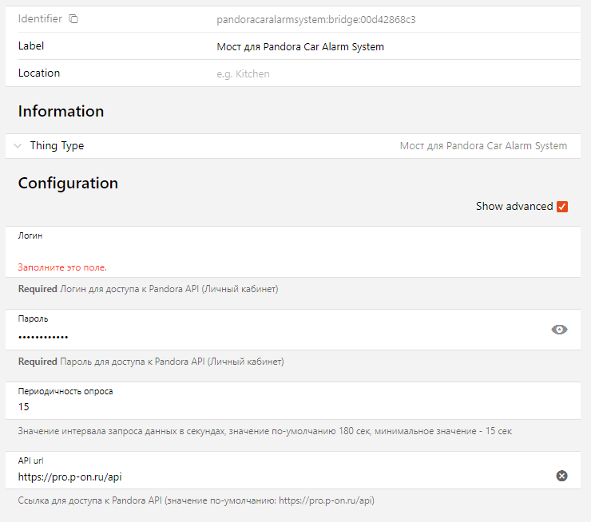
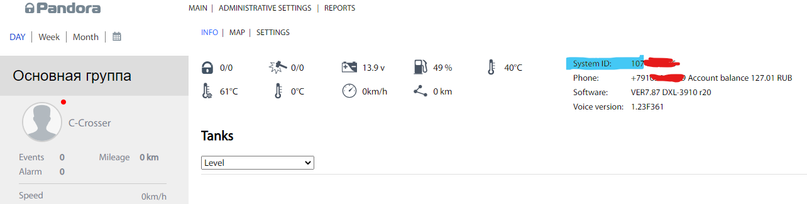

# Pandora Car Alarm System Binding

English Description | [Русское описание](README.md)

The Binding uses the **unofficial API** used in the official Pandora website https://p-on.ru, and you will need to use the same Username and Password you use on the Pandora website to configure this Binding.

#### **This version can only get data, can't send commands.**

## Supported Things

You can create one Bridge and some Things with different deviceID using the Bridge

- `bridge`: sends request to Pandora API to get info about device and events/options/states. Does not any cahnnels

- `thing`: uses the Bridge and has many channels combined to groups

## Discovery

Discovery not available

## Binding Configuration

Create a Bridge and put your login and password for https://pro.p-on.ru

The Bridge will polling https://pro.p-on.ru to get every X second to retrieve a device information, configuration and states.

The default polling interval is 180 sec. 

You can change it in advance settings (checkbox). Minival interval is 15 sec.

## Thing Configuration

After configuring the Bridge create one or more Things.

Each Thing should have a device Id. It is System Id in https://pro.p-on.ru

### Thing Configuration

| Name            | Type    | Description                           | Default | Required | Advanced |
|-----------------|---------|---------------------------------------|---------|----------|----------|
| deviceId        | text    | SystemID                              | N/A     | yes      | no       |

## Channels

There are three groups of channels
- _**device**_ - provides information about device such as name, model, firmware and etc.
- _**telemetry**_ - provides telelemetry such as battery voltage, engine temp, speed, fuel and etc. Some channels can't be available. It depends on car ability to provide information by CAN or other methods.
- _**states**_ - lock state, alarm state, door states and etc.

## Addition information

Before starting to develop the binding I studied (Developer Tools in Browser).

Many information is available in js-files.

This page [https://github.com/turbulator/pandora-cas](https://github.com/turbulator/pandora-cas) promted me to create the binding.

## Disclimer
This software is unofficial and isn't affiliated with or endorsed by ООО «НПО Телеметрия». You can use it at own risk.

All brand and/or product names are trademarks of their respective owners.

